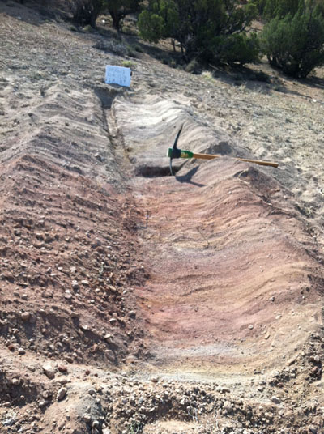
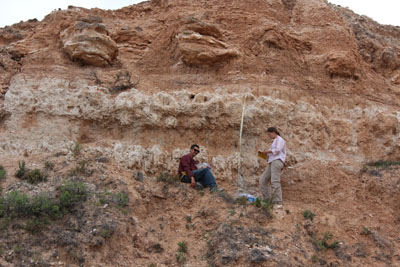

#### Research overview

Katie's research is broadly focused on the role of climate and tectonics in terrestrial paleoenvironmental change, and how to disentangle those effects from each other in the sedimentary geochemical record. In particular, she is focused on the climatic and tectonic evolution of the western US Cordillera, from 100 Ma to Present. In addition to these geologic applications, she is also interested in diagenesis of carbonate rocks, geochemical processes of modern terrestrial environments and stable isotope method development.

If you'd like to learn more about any of these topics, are interested in collaboration on these topics, or are a student interested in graduate research in these areas, please [get in touch](mailto:kathryn.snell@colorado.edu)!

**Current Topics**:

- Cretaceous evolution of the Sevier Hinterland
- Miocene - Pleistocene climate and vegetation change in the Great Plains
- Terrestrial climate during global "greenhouse" climate conditions and rapid climatic changes of the Paleogene
- Diagenesis of terrestrial carbonate rocks

---

#### Cretaceous evolution of the Sevier Hinterland

  
  
We recently received funding from NSF to explore the response of surface uplift to shortening in central Nevada during the early Cretaceous, and are actively recruiting a graduate student to start on this work. This project will extend estimates of the paleoelevation of the Sevier Hinterland further back in time from our previous estimates based on Late Cretaceous rocks from Nevada and Utah. 

  
Collaborators: Sean Long (WSU); Josh Bonde (UNLV); Peter Druscke (Exxon); Dick Hilton (Sierra College)

---

#### Miocene - Pleistocene climate and vegetation change, Meade Basin, SW Kansas

  
  
This is an ongoing study funded through the Earth-Life Transitions program at NSF, to explore the relative roles of climate or internal ecosystem structure in driving biologic changes in the Great Plains during the Neogene. Specific biologic changes include expansion of C4 grasslands and small mammal faunal changes.

  
Collaborators: David Fox (UMN); Kena Fox-Dobbs (U. of Puget Sound); Pratigya Polissar (Lamont); Kevin Uno (Lamont); Bill Lukens (Baylor); Bob Martin (Murray State)

